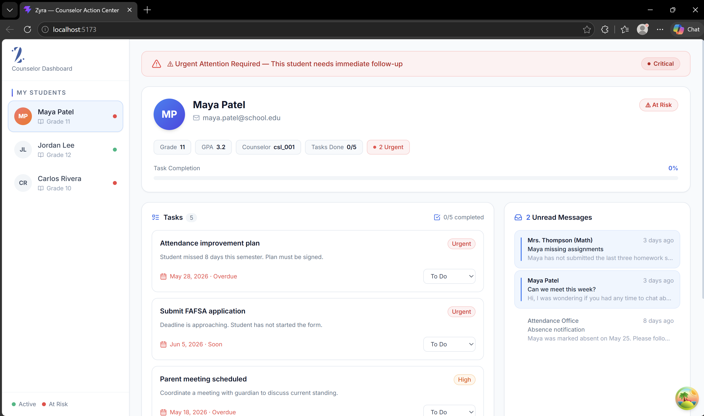
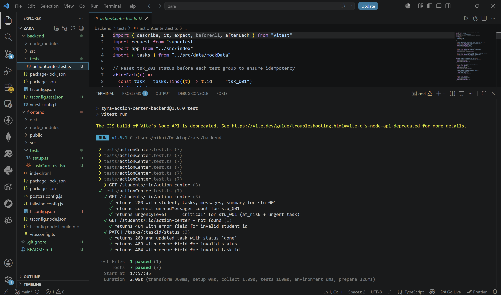
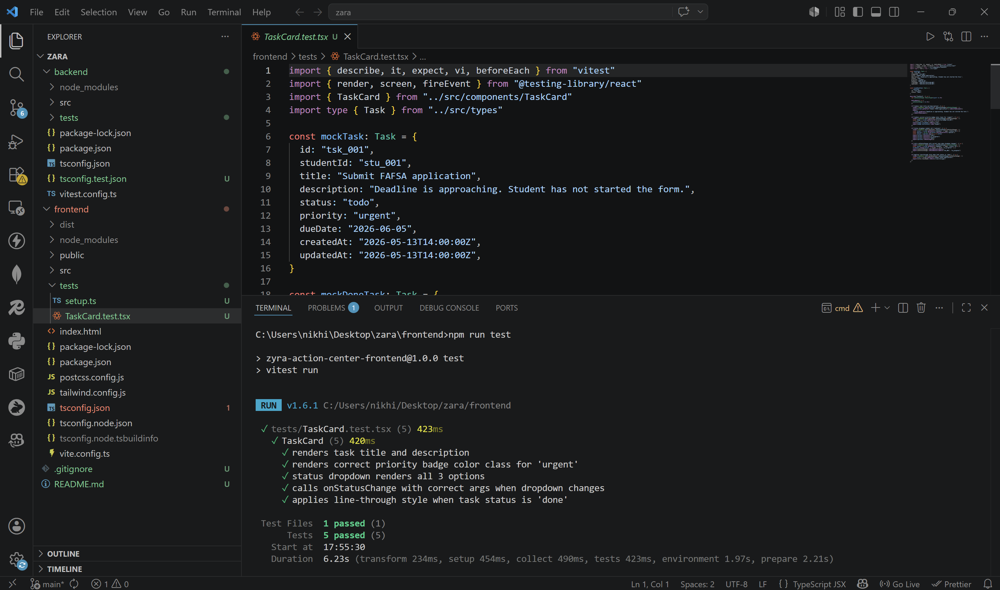

# Zyra — Counselor Student Action Center

> Take-home assessment submission for Zyra (zyra-ai.com).

---

## 🚀 Live Demo

**Frontend (Vercel):** [https://zyra-lilac.vercel.app/](https://zyra-lilac.vercel.app/)

The backend is deployed on Render and connected automatically. Open the link, click a student in the sidebar, update a task status — open two tabs and both update in real time.

---

## 📸 UI Preview



---

# ✅ Task 1: Core Assessment

## Objective

Build a mini full-stack feature — **Counselor Student Action Center** — that helps a counselor quickly understand a student's priorities, tasks, unread messages, and urgency level.

**Stack:** React + TypeScript + Vite (frontend) · Node.js + Express + TypeScript (backend)

---

## Setup & Run

### Prerequisites
- **Node.js 18+** (`node -v` to check)
- **npm** (comes with Node)

### Backend (port 3000)

```bash
cd backend
npm install
npm run dev
```

Expect: `Zyra Action Center API running on port 3000`

### Frontend (port 5173)

```bash
cd frontend
npm install
npm run dev
```

Open [http://localhost:5173](http://localhost:5173) in your browser.

> **No database setup required.** All data lives in memory and resets on server restart.

### Environment Variables

**Backend** — create `backend/.env.local`:
```env
PORT=3000
FRONTEND_URL=http://localhost:5173
```

**Frontend** — create `frontend/.env.local`:
```env
VITE_API_URL=http://localhost:3000
```

---

## Folder Structure

```
root/
├── backend/
│   ├── src/
│   │   ├── data/mockData.ts          # Exact mock data as provided in the spec
│   │   ├── middleware/
│   │   │   ├── errorHandler.ts       # Task 2: Request ID + JSON error responses
│   │   │   └── requestLogger.ts      # Task 2: Morgan HTTP logger with requestId
│   │   ├── routes/
│   │   │   ├── students.ts           # GET /students  +  GET /students/:id/action-center
│   │   │   ├── tasks.ts              # PATCH /tasks/:taskId/status
│   │   │   └── sse.ts                # GET /sse/task-updates (real-time broadcast)
│   │   └── index.ts                  # App bootstrap, CORS, middleware registration
│   └── tests/
│       └── actionCenter.test.ts      # Task 2: 7 integration tests
├── frontend/
│   ├── src/
│   │   ├── api/client.ts             # Typed fetch wrappers for all endpoints
│   │   ├── components/
│   │   │   ├── StudentSidebar.tsx    # Caseload nav with enrollment status indicators
│   │   │   ├── UrgencyBanner.tsx     # Color-coded urgency alert banner
│   │   │   ├── StudentProfile.tsx    # Profile card with GPA, task completion progress bar
│   │   │   ├── TaskList.tsx          # Priority-sorted task list with status mutations
│   │   │   ├── TaskCard.tsx          # Individual task card with status dropdown
│   │   │   ├── MessagesSummary.tsx   # Inbox panel with unread highlighting
│   │   │   └── Skeletons.tsx         # Loading skeleton components
│   │   ├── hooks/
│   │   │   ├── useActionCenter.ts    # React Query hooks: students, action center, status update
│   │   │   └── useSSE.ts             # EventSource hook with exponential backoff reconnect
│   │   ├── store/useStudentStore.ts  # Zustand store: selectedStudentId
│   │   ├── types/index.ts            # Shared TypeScript interfaces
│   │   ├── App.tsx                   # Two-panel layout
│   │   └── main.tsx                  # QueryClient config + React root
│   └── tests/
│       └── TaskCard.test.tsx         # Task 2: 5 component tests
├── screenshots/
│   ├── zyraCounselor.png
│   ├── backendTest.png
│   └── frontendTest.png
└── README.md
```

---

## API Contract

### `GET /students`

Returns a lightweight list for the sidebar (id, name, grade, enrollmentStatus only — no tasks or messages).

**Response `200`:**
```json
[
  { "id": "stu_001", "name": "Maya Patel", "grade": 11, "enrollmentStatus": "at_risk" },
  { "id": "stu_002", "name": "Jordan Lee", "grade": 12, "enrollmentStatus": "active" }
]
```

---

### `GET /students/:id/action-center`

Returns everything the dashboard needs for a single student in one round-trip.

**Request:**
```
GET /students/stu_001/action-center
```

**Response `200`:**
```json
{
  "student": {
    "id": "stu_001",
    "name": "Maya Patel",
    "email": "maya.patel@school.edu",
    "grade": 11,
    "gpa": 3.2,
    "counselorId": "csl_001",
    "enrollmentStatus": "at_risk"
  },
  "tasks": [ /* Task[] filtered by studentId */ ],
  "messages": [ /* Message[] filtered by studentId */ ],
  "summary": {
    "totalTasks": 5,
    "completedTasks": 0,
    "urgentTasks": 2,
    "unreadMessages": 2,
    "urgencyLevel": "critical"
  }
}
```

**Response `404`:**
```json
{
  "error": "Student with id \"invalid_id\" not found",
  "requestId": "uuid-v4-here",
  "timestamp": "2026-06-01T12:00:00.000Z"
}
```

---

### `PATCH /tasks/:taskId/status`

Updates a task's status and broadcasts the change to all SSE-connected clients.

**Request:**
```
PATCH /tasks/tsk_001/status
Content-Type: application/json

{ "status": "done" }
```

Valid statuses: `"todo"` | `"in_progress"` | `"done"`

**Response `200`:**
```json
{
  "task": {
    "id": "tsk_001",
    "studentId": "stu_001",
    "status": "done",
    "updatedAt": "2026-06-01T12:00:00.000Z"
  }
}
```

**Response `400` (invalid status):**
```json
{
  "error": "Invalid status. Must be one of: todo, in_progress, done",
  "requestId": "uuid",
  "timestamp": "..."
}
```

**Response `404`:**
```json
{ "error": "Task with id \"invalid_id\" not found", "requestId": "...", "timestamp": "..." }
```

---

### `GET /sse/task-updates`

Server-Sent Events stream. The frontend connects once on mount and keeps this open indefinitely for real-time task update notifications.

**Events:**
```
event: connected
data: {"message":"Connected to SSE stream"}

event: task_update
data: {"type":"TASK_UPDATED","taskId":"tsk_001","studentId":"stu_001","status":"done"}

: keepalive    (every 30 seconds)
```

---

## Architecture Note

### Overall Structure

The project is a standard two-tier web app: an Express REST API on the backend, and a React SPA on the frontend. They communicate over HTTP and a persistent SSE connection. No database — mock data lives in a shared in-memory module (`mockData.ts`) that all route handlers import.

### Backend Design

The backend has three route files, each owning a single resource:

- **`students.ts`** — `GET /students` (sidebar list) and `GET /students/:id/action-center` (consolidated dashboard data). The action-center endpoint computes urgency server-side because it needs both enrollment status and task data together.
- **`tasks.ts`** — `PATCH /tasks/:taskId/status`. After updating the in-memory task, it immediately calls `broadcastTaskUpdate()` from the SSE module.
- **`sse.ts`** — keeps a `Set<Response>` of all connected clients. `broadcastTaskUpdate` loops through and writes the event frame to each one.

The urgency calculation is a simple priority matrix:

```
at_risk + urgent tasks → critical
at_risk OR urgent tasks → high
high-priority tasks (non-urgent) → moderate
otherwise → low
```

### Frontend Design

State is split cleanly between server state and client state:

- **Server state** (tasks, student data, messages) is owned by **React Query**. It handles caching, deduplication, background refetch, and optimistic updates. The `queryKey` includes `studentId` so each student gets its own cache entry — switching students shows cached data instantly, then refetches silently.
- **Client state** (which student is selected) is owned by **Zustand**. One string, one setter — no reducers, no context provider needed.

The `useSSE` hook establishes an `EventSource` connection and on each `task_update` event calls `queryClient.invalidateQueries()` for the affected student, triggering a background refetch. This is simpler and more reliable than manually patching nested cache state.

Task status changes use **optimistic updates**: the UI flips the status instantly, saves the previous state as a rollback snapshot, and reverts if the server rejects the request.

### Why one consolidated endpoint instead of separate `/tasks` and `/messages`?

Every time a counselor clicks a student, the dashboard needs the profile, tasks, messages, and the computed urgency — all at once. Separate endpoints would mean 3+ parallel fetches per student switch, 3 loading states to coordinate, and the urgency calculation would have to happen on the frontend with incomplete data. One endpoint: one round-trip, one loading state, urgency computed where it has full context.

### Why SSE instead of WebSockets or polling?

Task updates are **server → client** only. SSE is purpose-built for this:
- HTTP-native — works through proxies and load balancers without special config
- Browser's `EventSource` API handles reconnection automatically
- Server implementation is just `res.write()` on a kept-alive response

With 30-second polling and 50 counselors online, that's 100 GET requests per minute to check for changes that may not exist. SSE pushes data only when something actually changes.

---

# ✅ Task 2: Bonus Assessment

## Objective

Improve quality, reliability, and performance of the feature as if preparing it for production.

---

## What Was Added

### 1. Backend Request Logging

`backend/src/middleware/requestLogger.ts` uses Morgan with a custom `requestId` token:

```typescript
morgan.token("requestId", (req) => req.requestId ?? "-")

export const requestLogger = morgan(
  ":method :url :status :response-time ms — reqId::requestId"
)
```

Every HTTP request is logged with the method, URL, status code, response time, and the request's unique ID. This means when a counselor reports something broke, you can correlate the frontend error (which includes `requestId`) directly to the backend log line.

Sample log output:
```
GET /students/stu_001/action-center 200 6.94 ms — reqId:e4283e0d-b6cd-4d72-82ca-82c24577db9a
PATCH /tasks/tsk_001/status 200 27.42 ms — reqId:126cb525-dffa-4333-b563-12aff240aeec
```

> In a real production environment I'd replace Morgan with `pino` for structured JSON logs, which are easier to query in Datadog or Elasticsearch. The `requestId` infrastructure is already in place — just needs a different transport.

### 2. Error Middleware with Request IDs

`backend/src/middleware/errorHandler.ts` has two parts:

**`attachRequestId`** — runs first on every request, before any route handler:

```typescript
export function attachRequestId(req, _res, next) {
  req.headers["x-request-id"] = req.headers["x-request-id"] ?? uuidv4()
  req.requestId = req.headers["x-request-id"]
  next()
}
```

It respects an incoming `X-Request-ID` header if the caller provides one (useful when a reverse proxy assigns IDs upstream), otherwise generates a fresh UUID.

**`errorHandler`** — the centralized error catch at the bottom of the middleware stack:

```typescript
export function errorHandler(err, req, res, _next) {
  const requestId = req.requestId ?? "unknown"
  const status = err.status ?? 500
  res.status(status).json({
    error: err.message,
    requestId,
    timestamp: new Date().toISOString(),
  })
}
```

Every error response — whether a 404 for a missing student, a 400 for an invalid status, or an unexpected 500 — has the same predictable shape. The `requestId` field ties the error back to the specific request in the server logs.

`express-async-errors` is installed alongside this to patch Express so that errors thrown inside `async` route handlers automatically reach `errorHandler`. Without it, unhandled promise rejections in async routes silently hang.

### 3. Integration Tests (Backend)



**7 tests** in `backend/tests/actionCenter.test.ts` using Vitest + Supertest:

```bash
cd backend && npm test
```

```
✓ GET /students/:id/action-center
  ✓ returns 200 with student, tasks, messages, summary for stu_001
  ✓ returns correct unreadMessages count (2) for stu_001
  ✓ returns urgencyLevel === 'critical' for stu_001 (at_risk + urgent task)

✓ GET /students/:id/action-center — not found
  ✓ returns 404 with error field for invalid student id

✓ PATCH /tasks/:taskId/status
  ✓ returns 200 and updated task with status 'done'
  ✓ returns 400 with error field for invalid status
  ✓ returns 404 with error field for invalid task id

Test Files  1 passed (1)
Tests       7 passed (7)
```

Supertest imports the Express `app` directly — no live server port needed. An `afterEach` hook resets `tsk_001` back to `"todo"` after each test group so tests don't bleed state into each other.

The `urgencyLevel === "critical"` test is particularly meaningful because it validates the algorithm across multiple conditions at once: it only returns `"critical"` when `enrollmentStatus === "at_risk"` AND there's at least one urgent non-done task. A student failing either condition alone returns `"high"`.

### 4. Component Tests (Frontend)



**5 tests** in `frontend/tests/TaskCard.test.tsx` using Vitest + @testing-library/react:

```bash
cd frontend && npm test
```

```
✓ TaskCard (5)
  ✓ renders task title and description
  ✓ renders correct priority badge color class for 'urgent'
  ✓ status dropdown renders all 3 options
  ✓ calls onStatusChange with correct args when dropdown changes
  ✓ applies line-through style when task status is 'done'

Test Files  1 passed (1)
Tests       5 passed (5)
```

`TaskCard` was chosen because it's the most interactive component — it renders task data, handles status changes, reflects visual states (overdue, done, pending) and fires callbacks. These tests verify the contract between the component and its parent (`TaskList`) without needing a full render tree.

The `data-testid="priority-badge-{task.id}"` attribute on the priority badge exists specifically to make test selection stable — not relying on CSS class strings or DOM structure that might change with styling updates.

---

## Performance Decisions & Tradeoffs

| Decision | Rationale |
|---|---|
| `staleTime: 30s` on React Query | Prevents redundant refetches on tab focus. Counselors don't need millisecond-fresh data between clicks — SSE handles actual real-time updates |
| Optimistic task status updates | Instant UI feedback on dropdown change; rollback is transparent if the backend rejects. `cancelQueries` prevents a slow in-flight GET from clobbering the optimistic state |
| Per-task pending spinner | `variables.taskId` from the React Query mutation lets us show a spinner only on the specific card being updated, not the whole list |
| SSE keepalive every 30s | Prevents intermediate proxies and load balancers (Nginx, AWS ALB) from closing idle connections — they typically kill connections silent after 60s |
| Exponential backoff on SSE reconnect | Prevents thundering-herd reconnections if the server restarts. Max 3 retries: 1s → 2s → 4s |
| Skeletons over spinners | Reduces Cumulative Layout Shift (CLS). The placeholder occupies the same space as real content, so the page doesn't jump when data loads |
| Client-side task sort | Fast for typical caseload sizes (5–15 tasks). Spreading into a `[...tasks].sort()` avoids mutating the React Query cache array. Would move to `ORDER BY` in a real DB |
| Hand-rolled `timeAgo()` formatter | Avoids importing `date-fns` or `moment` for a single format — keeps the frontend bundle smaller |
| CORS allows `*.vercel.app` regex | Vercel creates a new preview URL per deployment (e.g., `zyra-abc123.vercel.app`). The regex allows all of them automatically without updating env vars for every PR |
| Consolidated `action-center` endpoint | One round-trip per student switch instead of 3 parallel fetches for profile + tasks + messages. Urgency is computed server-side where all data is available together |

---

## Future Enhancements

If I were continuing this toward a real production release:

- **Database** — swap `mockData.ts` for MongoDB. Route logic is already separated from data access, so it'd be a targeted swap. Indexes on `studentId` for fast lookups; `findOneAndUpdate` for atomic task status changes.
- **Authentication** — JWT auth so counselors only see their own caseload. `counselorId` is already on every student record — just not enforced yet.
- **Pagination** — `?page=&limit=` on tasks and messages for large caseloads.
- **Redis Pub/Sub for SSE** — for horizontal scaling across multiple backend pods. Currently each pod has its own `clients` Set, so a `PATCH` to pod A won't notify a browser connected to pod B. Redis Pub/Sub fixes this.
- **Structured logging** — replace Morgan with `pino` (JSON output, queryable in Datadog/Elasticsearch). The `requestId` plumbing is already in place.
- **Zustand `persist` middleware** — restore `selectedStudentId` from `localStorage` so a page refresh lands the counselor on the same student. One middleware line to add.
- **Urgency rule engine** — make the algorithm configurable per school district so admins can tune thresholds without touching code.
- **Message read/unread mutation** — `PATCH /messages/:id/read` with optimistic update in the frontend.
- **Task creation** — `POST /tasks` endpoint and a modal form in the UI.
- **Timezone-aware date formatting** — current `formatDueDate` and `isDueSoon` use browser locale. For a multi-timezone school platform, pull in `date-fns-tz`.
